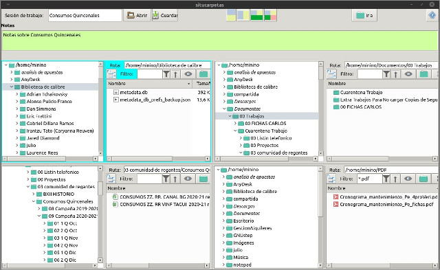
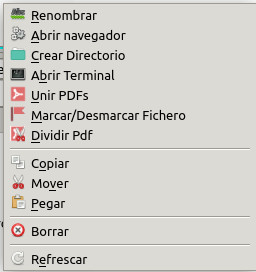
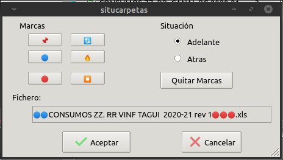
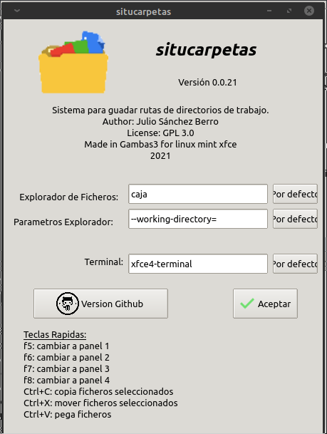

# situcarpetas

Explorador de ficheros con 4 paneles y capacidad de guardar y leer distintas configuraciones de ruta de cada panel. La idea es que cuando este trabajando en varios directorios a la vez [secciones de trabajo], poder recuperar en posteriores días y/o poder recuperar estas secciones de trabajo de forma sencilla y rápida.



Tenemos un menu popup en el fileview con las siguiente opciones



Podemos poner marcas (y quitarlas) con emojiconos a los ficheros. Una forma sencilla de ver rápidamente ficheros que tenemos que revisar, modificar, etc..



En el boton de ayuda podemos configurar los programas externos que se usan:



### Pre-requisitos 📋

Debes de tener instalado gambas3.15.
Puedes usar el PPA:

```
sudo add-apt-repository ppa:gambas-team/gambas3  
sudo apt-get update
sudo apt-get install gambas3
```

### Instalación 🔧

Puedes seguir los pasos indicados en este [enlace][enlace]:

[enlace]: https://gist.github.com/Nando98/2cd5fc89cb7cfbe9b5fba56220d05307

## Autores ✒️

* **Julio Sanchez Berro** 

## Licencia 📄

GPLv3
